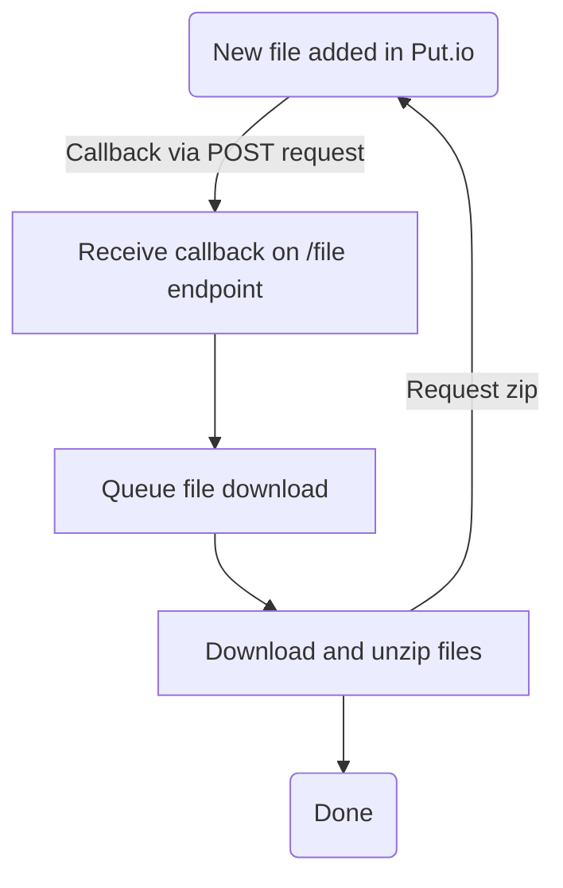

# Put.io File Downloader

<div align="center">
    
</div>

<div align="center">

  [](https://opensource.org/licenses/MIT)

</div>

**Put.io File Downloader** is an API that can receive file callbacks (webhooks) from [Put.io](https://put.io) and download them to a local directory.

To receive file callbacks from Put.io, configure the URL here: https://app.put.io/settings/callback-url

The API can receive multiple file callbacks simultaneously, but downloads are queued and retrieved one at a time.

See below for a flow of how the API works:



## Getting Started

Create a .env file in the root of the project like the following:

```sh
# Put.io access token
ACCESS_TOKEN=XXXXXXXX
# Processing directory for in-progress downloads
PROCESSING_DIR=./processing
# Location for downloaded files
DOWNLOAD_DIR=./download
```

### Download Schedule

You can enable a download schedule with a cron e.g.

```sh
DOWNLOAD_SCHEDULE_ENABLED=true
# Download files at 7am every day...
DOWNLOAD_SCHEDULE_CRON=0 7 * * *
```

## Install

```
npm install
```

## Development

Use the following to run the development server:

```sh
npm run dev
```

Open [http://localhost:3000](http://localhost:3000) to view it in the browser.

You can test a file callback using curl e.g.

```sh
curl -X POST localhost:3000/file \
-H "Content-Type: application/x-www-form-urlencoded" \
-d "file_id=<the-file-id>"
```

## Test

```sh
npm test
```

## Docker

To build and run the Docker container:

```sh
# Build the container
docker build -t putio-downloader .

# Create a folder to mount as a volume for downloads
mkdir data
chmod 755 data

# Run the container
docker run \
--volume ${PWD}/data:/data \
--env ACCESS_TOKEN="token" \
--env PROCESSING_DIR="/data/processing" \
--env DOWNLOAD_DIR="/data/download" \
-p 3000:3000 \
putio-downloader:latest
```
